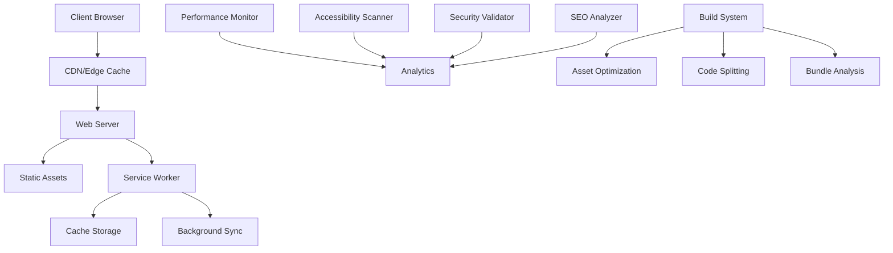

# Design Document

## Overview

This design document outlines a comprehensive optimization suite for the Kabi Tharma portfolio website. While the website has undergone significant modernization, this project focuses on achieving absolute excellence in performance, accessibility, security, and modern web standards. The design emphasizes systematic optimization, automated testing, and cutting-edge web technologies to create a portfolio that represents the pinnacle of modern web development.

## Architecture

### System Architecture



### Performance Architecture

1. **Multi-Layer Caching Strategy**
   - Browser cache with optimized headers
   - Service Worker cache with intelligent strategies
   - CDN edge caching for global performance
   - Memory cache for frequently accessed resources

2. **Asset Optimization Pipeline**
   - Image optimization with WebP/AVIF formats
   - CSS/JS minification and compression
   - Critical resource prioritization
   - Lazy loading for non-critical assets

3. **Modern Loading Strategies**
   - Resource hints (preload, prefetch, preconnect)
   - Code splitting for optimal bundle sizes
   - Progressive enhancement for core functionality
   - Streaming and incremental loading

## Components and Interfaces

### Core Optimization Engine

```typescript
interface OptimizationEngine {
  performance: PerformanceOptimizer;
  accessibility: AccessibilityEnhancer;
  security: SecurityHardener;
  seo: SEOOptimizer;
  monitoring: QualityMonitor;
}

interface PerformanceOptimizer {
  optimizeImages(): Promise<void>;
  minifyAssets(): Promise<void>;
  implementCaching(): Promise<void>;
  measureCoreWebVitals(): Promise<WebVitalsReport>;
}

interface AccessibilityEnhancer {
  validateWCAG(): Promise<AccessibilityReport>;
  enhanceKeyboardNavigation(): Promise<void>;
  improveScreenReaderSupport(): Promise<void>;
  implementARIA(): Promise<void>;
}
```

### Performance Monitoring System

```typescript
interface PerformanceMonitor {
  trackCoreWebVitals(): void;
  measureResourceTiming(): void;
  analyzeRenderBlocking(): void;
  reportPerformanceBudget(): void;
}

interface WebVitalsReport {
  lcp: number; // Largest Contentful Paint
  fid: number; // First Input Delay
  cls: number; // Cumulative Layout Shift
  fcp: number; // First Contentful Paint
  ttfb: number; // Time to First Byte
}
```

### Security Enhancement Module

```typescript
interface SecurityHardener {
  implementCSP(): Promise<void>;
  configureSecurityHeaders(): Promise<void>;
  validateInputSanitization(): Promise<void>;
  auditDependencies(): Promise<SecurityReport>;
}

interface SecurityReport {
  cspViolations: CSPViolation[];
  vulnerabilities: Vulnerability[];
  securityScore: number;
  recommendations: string[];
}
```

### Accessibility Enhancement System

```typescript
interface AccessibilityEnhancer {
  implementWCAGAAA(): Promise<void>;
  enhanceKeyboardNavigation(): Promise<void>;
  optimizeScreenReaderExperience(): Promise<void>;
  addVoiceCommandSupport(): Promise<void>;
}

interface AccessibilityReport {
  wcagLevel: 'A' | 'AA' | 'AAA';
  violations: AccessibilityViolation[];
  score: number;
  improvements: string[];
}
```

## Data Models

### Performance Metrics Model

```typescript
interface PerformanceMetrics {
  timestamp: Date;
  url: string;
  metrics: {
    lcp: number;
    fid: number;
    cls: number;
    fcp: number;
    ttfb: number;
    totalBlockingTime: number;
    speedIndex: number;
  };
  deviceType: 'mobile' | 'desktop' | 'tablet';
  connection: 'slow-2g' | '2g' | '3g' | '4g' | '5g';
}
```

### Accessibility Audit Model

```typescript
interface AccessibilityAudit {
  timestamp: Date;
  wcagLevel: 'A' | 'AA' | 'AAA';
  violations: {
    rule: string;
    severity: 'minor' | 'moderate' | 'serious' | 'critical';
    element: string;
    description: string;
    fix: string;
  }[];
  score: number;
  passedRules: string[];
}
```

### Security Assessment Model

```typescript
interface SecurityAssessment {
  timestamp: Date;
  headers: {
    csp: boolean;
    hsts: boolean;
    xFrameOptions: boolean;
    xContentTypeOptions: boolean;
    referrerPolicy: boolean;
  };
  vulnerabilities: {
    type: string;
    severity: 'low' | 'medium' | 'high' | 'critical';
    description: string;
    mitigation: string;
  }[];
  score: number;
}
```

## Error Handling

### Comprehensive Error Management

1. **Performance Error Handling**
   - Graceful degradation for slow connections
   - Fallback strategies for failed resource loads
   - Progressive enhancement for unsupported features
   - User-friendly error messages for network issues

2. **Accessibility Error Recovery**
   - Fallback content for screen readers
   - Alternative navigation methods
   - Error announcements via ARIA live regions
   - Keyboard trap prevention and recovery

3. **Security Error Mitigation**
   - CSP violation reporting and handling
   - Input validation with sanitization
   - XSS prevention with proper encoding
   - CSRF protection with token validation

4. **SEO Error Prevention**
   - Structured data validation
   - Meta tag completeness checks
   - Canonical URL verification
   - Sitemap accuracy validation

### Error Reporting System

```typescript
interface ErrorReporter {
  reportPerformanceIssue(issue: PerformanceIssue): void;
  reportAccessibilityViolation(violation: AccessibilityViolation): void;
  reportSecurityIncident(incident: SecurityIncident): void;
  reportSEOIssue(issue: SEOIssue): void;
}
```

## Testing Strategy

### Automated Testing Framework

1. **Performance Testing**
   - Lighthouse CI integration for continuous monitoring
   - Core Web Vitals tracking with real user metrics
   - Performance budget enforcement
   - Cross-device performance validation

2. **Accessibility Testing**
   - Automated WCAG compliance checking
   - Screen reader simulation testing
   - Keyboard navigation validation
   - Color contrast verification

3. **Security Testing**
   - Automated vulnerability scanning
   - CSP policy validation
   - Dependency security auditing
   - Input sanitization testing

4. **Cross-Browser Testing**
   - Modern browser compatibility validation
   - Progressive enhancement verification
   - Polyfill effectiveness testing
   - Feature detection accuracy

### Testing Implementation

```typescript
interface TestingSuite {
  runPerformanceTests(): Promise<PerformanceTestResults>;
  runAccessibilityTests(): Promise<AccessibilityTestResults>;
  runSecurityTests(): Promise<SecurityTestResults>;
  runCompatibilityTests(): Promise<CompatibilityTestResults>;
  generateComprehensiveReport(): Promise<QualityReport>;
}
```

### Continuous Integration Testing

1. **Pre-deployment Validation**
   - Performance regression detection
   - Accessibility compliance verification
   - Security vulnerability scanning
   - SEO optimization validation

2. **Post-deployment Monitoring**
   - Real-time performance tracking
   - User experience monitoring
   - Error rate analysis
   - Conversion funnel optimization

## Implementation Phases

### Phase 1: Foundation Optimization
- Core Web Vitals optimization
- Critical CSS implementation
- Service Worker enhancement
- Basic accessibility improvements

### Phase 2: Advanced Performance
- Image optimization pipeline
- Code splitting implementation
- Advanced caching strategies
- Resource prioritization

### Phase 3: Accessibility Excellence
- WCAG AAA compliance implementation
- Advanced keyboard navigation
- Voice command integration
- Screen reader optimization

### Phase 4: Security Hardening
- Comprehensive CSP implementation
- Advanced security headers
- Input validation enhancement
- Dependency security audit

### Phase 5: Modern Web Features
- Advanced PWA capabilities
- Web Workers implementation
- Background sync functionality
- Push notification system

### Phase 6: Monitoring and Analytics
- Real-time performance monitoring
- User experience analytics
- Automated quality reporting
- Continuous optimization feedback

## Technology Stack

### Core Technologies
- **HTML5**: Semantic markup with modern features
- **CSS3**: Grid, Flexbox, Custom Properties, Container Queries
- **JavaScript ES2022+**: Modern syntax with proper fallbacks
- **TypeScript**: Type safety and better development experience

### Performance Technologies
- **Service Workers**: Advanced caching and offline functionality
- **Web Workers**: Heavy computation offloading
- **Intersection Observer**: Efficient lazy loading
- **Performance Observer**: Real-time metrics collection

### Build and Optimization Tools
- **Vite**: Modern build tool with optimizations
- **PostCSS**: CSS processing and optimization
- **Terser**: JavaScript minification
- **Sharp**: Image optimization

### Testing and Quality Assurance
- **Lighthouse**: Performance and quality auditing
- **axe-core**: Accessibility testing
- **ESLint**: Code quality enforcement
- **Prettier**: Code formatting consistency

## Success Metrics

### Performance Targets
- Lighthouse Performance Score: 98+
- First Contentful Paint: <1.0s
- Largest Contentful Paint: <1.5s
- Cumulative Layout Shift: <0.05
- First Input Delay: <50ms

### Accessibility Goals
- WCAG 2.1 AAA compliance: 100%
- Keyboard navigation: Complete coverage
- Screen reader compatibility: Full support
- Color contrast ratio: 7:1 minimum

### Security Standards
- Security headers: Complete implementation
- CSP violations: Zero tolerance
- Vulnerability score: A+ rating
- Dependency security: 100% clean

### SEO Optimization
- Core Web Vitals: All green
- Structured data: Complete implementation
- Meta tag optimization: 100% coverage
- Mobile-first indexing: Fully optimized

This design provides a comprehensive framework for achieving absolute excellence in all aspects of modern web development while maintaining the existing functionality and visual appeal of the portfolio website.