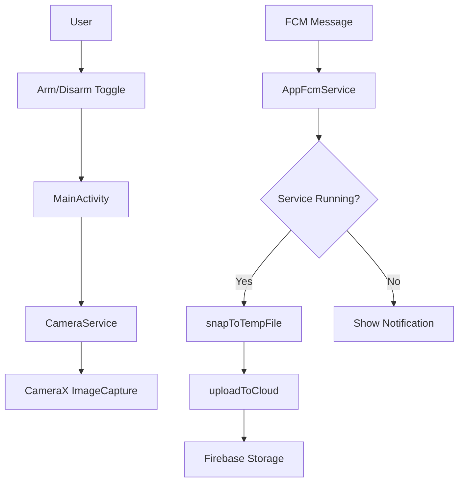
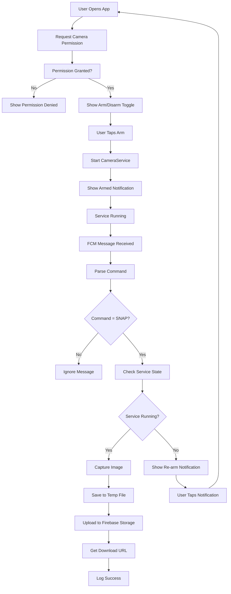

# Android Camera Service with FCM and Firebase Storage Design

## Overview

This design outlines the implementation of a remote-controlled camera service for the Snapassist Android application. The system enables remote photo capture via Firebase Cloud Messaging (FCM) commands, utilizing CameraX for image capture, foreground services for background operation, and Firebase Storage for cloud upload.

**Core Functionality:**
- Remote camera activation through FCM data messages
- Foreground camera service for background photo capture
- Automatic Firebase Storage upload with secure access rules
- Simple UI for service arm/disarm control

## Technology Stack & Dependencies

### Required Dependencies
- **CameraX**: Core camera functionality (camera-core, camera-camera2, camera-lifecycle, camera-view)
- **Firebase**: FCM messaging, Authentication, Storage
- **Jetpack Compose**: UI implementation
- **Lifecycle Service**: Background service management
- **AndroidX**: Core Android components

### Gradle Configuration
```kotlin
// app/build.gradle.kts additions
dependencies {
    // CameraX
    implementation(libs.camerax.core)
    implementation(libs.camerax.camera2)
    implementation(libs.camerax.lifecycle)
    implementation(libs.camerax.view)
    
    // Firebase
    implementation(platform(libs.firebase.bom))
    implementation(libs.firebase.messaging)
    implementation(libs.firebase.storage)
    implementation(libs.firebase.auth)
}
```

## Architecture

### Component Overview



### Service Architecture

**CameraService (Foreground Service)**
- Extends `LifecycleService` for lifecycle-aware operation
- Maintains persistent notification while running
- Binds CameraX ImageCapture for instant photo capture
- Exposes suspend function for remote capture requests

**AppFcmService (Firebase Messaging)**
- Handles incoming FCM data messages
- Processes "SNAP" commands with 20-second execution limit
- Manages service state validation and notification fallbacks

## AndroidManifest.xml Configuration

### Required Permissions
```xml
<!-- Camera access -->
<uses-permission android:name="android.permission.CAMERA" />

<!-- Foreground service permissions -->
<uses-permission android:name="android.permission.FOREGROUND_SERVICE" />
<uses-permission android:name="android.permission.FOREGROUND_SERVICE_CAMERA" />

<!-- Internet for Firebase -->
<uses-permission android:name="android.permission.INTERNET" />

<!-- Notification permission (Android 13+) -->
<uses-permission android:name="android.permission.POST_NOTIFICATIONS" />
```

### Service Declarations
```xml
<application>
    <!-- Camera Foreground Service -->
    <service
        android:name=".service.CameraService"
        android:enabled="true"
        android:exported="false"
        android:foregroundServiceType="camera" />

    <!-- Firebase Messaging Service -->
    <service
        android:name=".service.AppFcmService"
        android:exported="false">
        <intent-filter>
            <action android:name="com.google.firebase.MESSAGING_EVENT" />
        </intent-filter>
    </service>
</application>
```

## Core Components Design

### 1. CameraService Implementation

**Class Structure:**
- Extends `LifecycleService`
- Implements `LifecycleOwner` for CameraX integration
- Manages foreground notification lifecycle

**Key Methods:**
- `onCreate()`: Initialize CameraX, start foreground notification
- `bindImageCapture()`: Configure back camera with ImageCapture use case
- `suspend fun snapToTempFile(): Uri`: Capture image to temporary file
- `onDestroy()`: Cleanup camera resources

**Notification Management:**
- Persistent "Armed" notification with service controls
- Notification channel for foreground service
- Action buttons for immediate disarm

### 2. AppFcmService Implementation

**Message Processing Flow:**
1. Receive FCM data message
2. Extract and validate command ("SNAP")
3. Check CameraService running state
4. Execute capture or show fallback notification
5. Log operation results within 20-second limit

**Error Handling:**
- Service unavailable: High-priority notification to re-arm
- Camera permission denied: Request permission notification
- Network failure: Retry mechanism with exponential backoff

### 3. Firebase Storage Integration

**Upload Architecture:**
- Structured path: `shots/{uid}/{timestamp}.jpg`
- Atomic upload with progress tracking
- Download URL generation for access
- Automatic retry on network failure

**Storage Security Rules:**
```javascript
// storage.rules
rules_version = '2';
service firebase.storage {
  match /b/{bucket}/o {
    match /shots/{userId}/{allPaths=**} {
      allow read, write: if request.auth != null && request.auth.uid == userId;
    }
  }
}
```

## Data Models & State Management

### Service State Model
```kotlin
data class CameraServiceState(
    val isRunning: Boolean = false,
    val isCapturing: Boolean = false,
    val lastCaptureTime: Long? = null,
    val errorMessage: String? = null
)
```

### FCM Message Schema
```json
{
  "data": {
    "cmd": "SNAP",
    "timestamp": "1234567890",
    "priority": "high"
  }
}
```

### Upload Result Model
```kotlin
sealed class UploadResult {
    data class Success(val downloadUrl: String) : UploadResult()
    data class Error(val exception: Exception) : UploadResult()
    object InProgress : UploadResult()
}
```

## UI Architecture

### MainActivity Compose Structure

**Component Hierarchy:**
- `MainActivity` → `CameraControlScreen` → `ArmToggleCard`
- State management with `remember` and `LaunchedEffect`
- Permission handling with `rememberLauncherForActivityResult`

**Key UI Elements:**
- Service status indicator (Armed/Disarmed)
- Toggle button with loading states
- Permission request dialog
- Last capture timestamp display

**State Flow:**
1. Check camera permission on launch
2. Request permission if not granted
3. Display service toggle when permission available
4. Bind to CameraService for real-time status updates

## Testing Strategy

### Unit Testing Scope
- `CameraService` capture logic isolation
- `AppFcmService` message processing validation
- Firebase Storage upload error handling
- Permission state management

### Integration Testing Areas
- FCM message end-to-end flow
- Camera capture with storage upload
- Service lifecycle with notification management
- UI state synchronization with service status

### Test Data Requirements
- Mock FCM messages with various command types
- Simulated camera capture responses
- Firebase Storage upload success/failure scenarios
- Permission grant/deny user interactions

## Testing & Deployment Guide

### Development Setup

**1. Firebase Configuration**
```bash
# Add google-services.json to app/ directory
# Obtain from Firebase Console → Project Settings → Your Android App
```

**2. Device Token Retrieval**
```kotlin
FirebaseMessaging.getInstance().token.addOnCompleteListener { task ->
    if (!task.isSuccessful) {
        Log.w(TAG, "Fetching FCM registration token failed", task.exception)
        return@addOnCompleteListener
    }
    // Get new FCM registration token
    val token = task.result
    Log.d(TAG, "FCM Token: $token")
}
```

**3. Test FCM Message Format**
```json
// Firebase Console → Cloud Messaging → Send Test Message
{
  "data": {
    "cmd": "SNAP"
  },
  "android": {
    "priority": "high"
  }
}
```

### Verification Steps

1. **Service Arming**: Toggle service in UI, verify persistent notification
2. **Remote Capture**: Send FCM test message, confirm image capture
3. **Storage Upload**: Check Firebase Storage console for uploaded files
4. **Permission Handling**: Test camera permission request flow
5. **Background Behavior**: Verify service continues when app backgrounded

### System Flow Diagram

