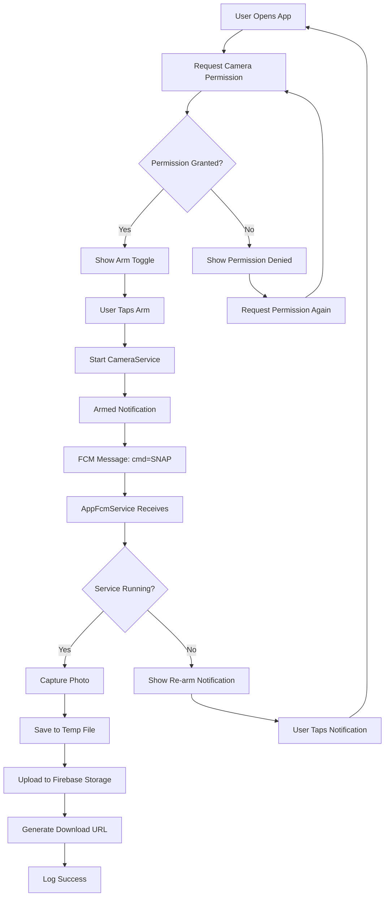

# Snapassist - Remote Camera Control

Snapassist is an Android application that enables remote photo capture via Firebase Cloud Messaging (FCM). The app uses CameraX for image capture, runs as a foreground service for background operation, and automatically uploads captured photos to Firebase Storage.

## Features

- **Remote Camera Control**: Capture photos remotely via FCM data messages
- **Foreground Service**: Background camera service with persistent notification
- **Secure Storage**: Automatic upload to Firebase Storage with user-specific access
- **Real-time UI**: Simple toggle interface for arming/disarming the camera service
- **Permission Management**: Runtime camera permission handling

## System Flow

The following diagram illustrates the complete flow from arming the service to photo upload:



## Architecture

The application consists of:
- `CameraService`: Foreground service managing CameraX ImageCapture
- `AppFcmService`: Firebase Messaging service processing SNAP commands
- `MainActivity`: Compose UI for service control and status display
- `FirebaseStorageUtil`: Utility for secure cloud storage uploads

## Firebase Setup

### 1. Add google-services.json

1. Go to [Firebase Console](https://console.firebase.google.com/)
2. Select your project (or create a new one)
3. Navigate to **Project Settings** → **Your Android App**
4. Download `google-services.json`
5. Place the file in `app/google-services.json` (it should already be there)

### 2. Enable Required Services

**Firebase Authentication:**
1. Go to **Authentication** → **Sign-in method**
2. Enable at least one sign-in provider (Email/Password recommended for testing)
3. Create a test user account

**Firebase Cloud Messaging:**
1. Go to **Cloud Messaging**
2. No additional setup required - FCM is enabled by default

**Firebase Storage:**
1. Go to **Storage** → **Get started**
2. Choose your security rules mode (start in test mode for development)\n3. Deploy the security rules from `storage.rules`:\n   ```bash\n   firebase deploy --only storage\n   ```

### 3. Deploy Storage Security Rules

```bash\n# Install Firebase CLI\nnpm install -g firebase-tools\n\n# Login to Firebase\nfirebase login\n\n# Initialize Firebase in your project directory\nfirebase init storage\n\n# Replace the generated storage.rules with the provided rules\n# Then deploy\nfirebase deploy --only storage\n```\n\n### 4. Obtain Device FCM Token\n\nTo get your device's FCM token for testing:\n\n1. Build and run the app on your device\n2. Check the logs for the FCM token:\n   ```bash\n   adb logcat | grep \"FCM Token\"\n   ```\n3. Or add this code temporarily to `MainActivity.onCreate()`:\n   ```kotlin\n   FirebaseMessaging.getInstance().token.addOnCompleteListener { task ->\n       if (task.isSuccessful) {\n           val token = task.result\n           Log.d(\"FCM_TOKEN\", \"Token: $token\")\n           // You can also display this in the UI temporarily\n       }\n   }\n   ```\n\n## Testing the Application\n\n### 1. Setup and Arm\n\n1. **Install the app** on your Android device\n2. **Grant camera permission** when prompted\n3. **Sign in** to Firebase (if using Authentication)\n4. **Tap \"Arm Camera\"** - you should see:\n   - Status changes to \"Armed\"\n   - Persistent notification appears\n   - Green status indicator\n\n### 2. Send Test FCM Message\n\n**Option A: Firebase Console (Recommended for testing)**\n\n1. Go to [Firebase Console](https://console.firebase.google.com/) → **Cloud Messaging**\n2. Click **\"Send your first message\"**\n3. **Notification tab**: Leave empty (we're using data messages)\n4. **Additional options** → **Advanced options**\n5. **Custom data**:\n   ```json\n   {\n     \"cmd\": \"SNAP\"\n   }\n   ```\n6. **Target**: Select your app and paste the device token\n7. **Scheduling**: Send now\n8. Click **\"Send message\"**\n\n**Option B: Using curl (for automation)**\n\n```bash\ncurl -X POST https://fcm.googleapis.com/fcm/send \\\n  -H \"Authorization: key=YOUR_SERVER_KEY\" \\\n  -H \"Content-Type: application/json\" \\\n  -d '{\n    \"to\": \"DEVICE_FCM_TOKEN\",\n    \"data\": {\n      \"cmd\": \"SNAP\"\n    },\n    \"android\": {\n      \"priority\": \"high\"\n    }\n  }'\n```\n\n**Option C: Firebase Admin SDK (for production)**\n\n```javascript\nconst admin = require('firebase-admin');\n\nawait admin.messaging().send({\n  token: 'DEVICE_FCM_TOKEN',\n  data: {\n    cmd: 'SNAP'\n  },\n  android: {\n    priority: 'high'\n  }\n});\n```\n\n### 3. Verify Photo Upload\n\n1. After sending the SNAP command, check the device logs:\n   ```bash\n   adb logcat | grep -E \"(CameraService|AppFcmService|FirebaseStorage)\"\n   ```\n\n2. **View uploaded files**:\n   - Go to [Firebase Console](https://console.firebase.google.com/) → **Storage**\n   - Navigate to **Files** → `shots/` → `{user-id}/`\n   - You should see a timestamped `.jpg` file\n   - Click the file to view/download\n\n### 4. Expected Behavior\n\n**Successful Flow:**\n1. FCM message received → \"SNAP command received\" in logs\n2. Service check passes → \"CameraService is running\" in logs\n3. Photo captured → \"Photo saved successfully\" in logs  \n4. Upload completes → \"Upload successful. Download URL: ...\" in logs\n5. File appears in Firebase Storage console\n\n**Error Scenarios:**\n- Service not armed → High-priority notification to re-arm\n- Camera permission denied → Permission request notification\n- Network failure → Retry with exponential backoff\n\n## Troubleshooting\n\n### Common Issues\n\n**FCM messages not received:**\n- Ensure the app is in foreground or background (not killed)\n- Check if data messages are being used (not notification messages)\n- Verify the FCM token is current and valid\n- Test with Firebase Console first\n\n**Camera service fails to start:**\n- Check camera permission is granted\n- Verify `FOREGROUND_SERVICE` and `FOREGROUND_SERVICE_CAMERA` permissions\n- Check Android version compatibility (API 21+)\n\n**Photo upload fails:**\n- Ensure user is authenticated with Firebase Auth\n- Check internet connectivity\n- Verify storage rules are deployed correctly\n- Check Firebase Storage quota limits\n\n**Permission issues:**\n- Camera permission must be granted at runtime\n- Notification permission required for Android 13+ (API 33+)\n- Foreground service permissions declared in manifest\n\n### Debug Commands\n\n```bash\n# View all app logs\nadb logcat | grep com.senthapps.snapassist\n\n# Filter for specific components\nadb logcat | grep -E \"(CameraService|AppFcmService)\"\n\n# Check FCM token\nadb logcat | grep \"FCM Token\"\n\n# View notification status\nadb shell dumpsys notification | grep com.senthapps.snapassist\n\n# Check foreground services\nadb shell dumpsys activity services | grep CameraService\n```\n\n## Build Requirements\n\n- **Minimum SDK**: API 21 (Android 5.0)\n- **Target SDK**: API 34 (Android 14)\n- **Compile SDK**: API 34\n- **Java**: JDK 8 or higher\n- **Gradle**: 8.0+\n- **Android Gradle Plugin**: 8.1+\n\n## Dependencies\n\nThe app uses these key dependencies (managed via `libs.versions.toml`):\n\n- **CameraX**: Core camera functionality\n- **Firebase**: Messaging, Storage, Authentication\n- **Jetpack Compose**: UI framework\n- **Lifecycle Service**: Background service management\n- **AndroidX**: Core Android components\n\n## Security Considerations\n\n- **Storage Rules**: Users can only access their own uploaded photos\n- **Authentication**: Required for Firebase Storage access\n- **Permissions**: Camera and foreground service permissions properly declared\n- **Data Privacy**: Photos stored in user-specific Firebase Storage paths\n\n## License\n\nThis project is for educational purposes. See individual dependency licenses for their respective terms.